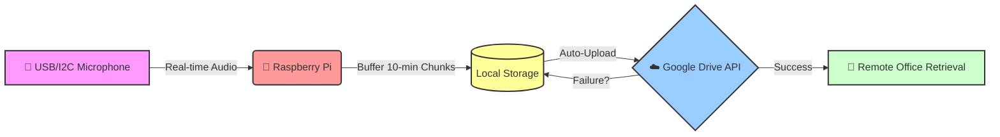

# Bioacoustic Edge Sync

🚀 **Real-time Data Acquisition & Cloud Integration for Remote Field Monitoring**

The `bioacoustic-edge-sync` project provides a robust, edge-computing solution tailored for continuous bioacoustics monitoring in remote or hostile environments. Utilizing a Raspberry Pi paired with USB/I2C microphones, the system guarantees high-fidelity audio capture in synchronized chunks and automatically backs up data to Google Drive. This enables researchers to retrieve field data directly from their office without requiring physical access to the device.

---

## 🏗️ Technical Architecture

The workflow emphasizes stability, redundancy, and automation. Audio is captured, temporarily buffered on the edge device, and sequentially pushed to the cloud.



## ✨ Core Features

*   ⏱️ **10-Minute Chunking**: Audio is continuously recorded and seamlessly partitioned into 10-minute `.wav` segments (configurable) to prevent file corruption and memory overflow on the edge device.
*   ☁️ **Cloud Redundancy**: Automated Google Drive integration ensures every recorded chunk is safely transmitted to the cloud as soon as it is generated, drastically reducing the risk of data loss.
*   🔄 **Auto-reconnect on Network Failure**: The upload agent utilizes sophisticated retry logic. If the cellular or Wi-Fi network drops, files remain safely buffered on the local storage and upload attempts automatically resume when the connection is restored.
*   🔌 **Plug-and-Play Hardware**: Built primarily for the Raspberry Pi 4, the software dynamically identifies and connects to any compatible USB microphone (e.g., AudioMoth in USB mode or standard USB mic).

## 🗂️ Project Structure

```text
bioacoustic-edge-sync/
├── README.md               # Project documentation
├── requirements.txt        # Python dependencies
├── src/
│   ├── main.py             # Main orchestration loop
│   ├── recorder.py         # PyAudio audio acquisition logic
│   └── uploader.py         # PyDrive Google Cloud API integration
└── config/
    └── settings.yaml       # User configuration, durations, API IDs
```

## 🛠️ Installation & Setup

### 1. Hardware Prerequisites
*   Raspberry Pi 4 (or latest)
*   USB Microphone (e.g., AudioMoth)
*   Internet connection (Wi-Fi or Cellular Dongle)

### 2. Software Installation

Clone the repository and install dependencies:

```bash
git clone https://github.com/yourusername/bioacoustic-edge-sync.git
cd bioacoustic-edge-sync
pip install -r requirements.txt
```

### 3. Google Drive API Authentication
1. Go to the [Google Cloud Console](https://console.cloud.google.com/).
2. Create a Project and enable the **Google Drive API**.
3. Create **OAuth 2.0 Client IDs** and download the `client_secrets.json` file.
4. Place the `client_secrets.json` file in the root directory of the project.

### 4. Configuration
Edit the `config/settings.yaml` file to match your requirements. 
*Note: You must replace `parent_folder_id` with your actual Google Drive destination folder ID.*

```yaml
recording:
  chunk_duration_seconds: 600   # 10 minutes
  sample_rate: 44100            # Default high-fidelity audio
  channels: 1                   # Mono recording
  local_storage_dir: "data_buffer" # Temporary buffer folder

drive:
  parent_folder_id: "Your_Google_Drive_Folder_ID_Here" 
  target_folder_name: "Bioacoustic_Field_Data"         
```

## 🚀 Execution

To start the continuous monitoring pipeline, simply run the orchestrator script:

```bash
python src/main.py
```

The system will automatically locate the USB microphone, begin recording 10-minute chunks, and continuously sync them to your Google Drive. 
